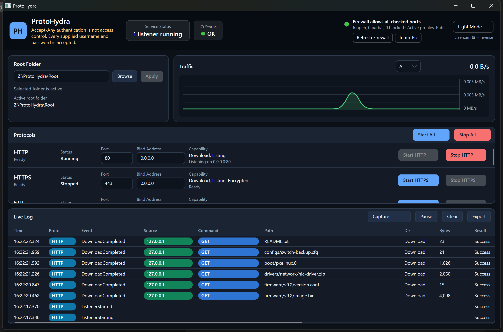

<a id="filehydra"></a>
# ProtoHydra

**Sprache / Language:  [🇩🇪 Deutsch](#-deutsch)  ·  [🇬🇧 English](#-english)**

**Multi-Protokoll-Dateiserver für Systemadministratoren – sieben Protokolle, ein Ordner, ein Klick.**
_Multi-protocol file server for system administrators – seven protocols, one folder, one click._

---

<a id="-deutsch"></a>
## 🇩🇪 Deutsch

ProtoHydra ist eine portable Windows-Desktopanwendung, die einen einzigen Ordner gleichzeitig über **TFTP, FTP, FTPS, SFTP, SCP, HTTP und HTTPS** bereitstellt. Statt für jeden Wartungsfall einen anderen Server zu installieren und zu konfigurieren, startest du ProtoHydra, wählst einen Ordner und aktivierst genau die Protokolle, die das Gerät oder der Client gerade erwartet – ohne Installation, ohne Dienst, ohne Domänenintegration.

Gedacht ist das Werkzeug für den Admin-Alltag: Netzwerkgeräte flashen, Appliances bootstrappen, Konfigurationen ein- und ausspielen, Recovery-Images ausliefern – oft an einem isolierten Wartungslaptop, direkt neben dem Rack.



### Wofür Systemadministratoren ProtoHydra einsetzen

- **Firmware-Upgrades von Netzwerkgeräten.** Switches, Router, FC-Fabrics, WLAN-Controller und Storage-Appliances erwarten ihr Firmware-Image je nach Hersteller über TFTP, SCP oder SFTP – und oft mit exakt einem passenden Protokoll. ProtoHydra bietet den Firmware-Ordner über alle Varianten parallel an, sodass du nicht raten musst, welches das Zielgerät akzeptiert.
- **Backup und Restore von Gerätekonfigurationen.** `copy running-config tftp:` bzw. der SCP-/SFTP-Upload eines Config-Exports landet direkt im Root-Ordner; der Restore geht denselben Weg zurück.
- **PXE- und Netzwerk-Boot.** Der TFTP-Dienst liefert Bootloader (`pxelinux.0`, `ipxe.efi`, WDS-Stufen), während HTTP große Boot-Images (WIM, Squashfs, ISO) deutlich schneller ausliefert als TFTP.
- **Ausliefern von Treibern, Agents und Installationspaketen.** Ein Gerät oder Techniker im Feld lädt per HTTP/HTTPS im Browser oder per Skript – mit klickbarem Verzeichnislisting.
- **Datenaustausch in abgeschotteten oder Air-Gap-Netzen.** Wenn kein zentraler Fileserver erreichbar ist, überbrückt ein Wartungslaptop mit ProtoHydra die Lücke, ohne dass etwas dauerhaft installiert wird.
- **Interoperabilitäts- und Client-Tests.** Reproduzierbar prüfen, wie sich ein Client oder eine Appliance gegenüber FTP, FTPS, SFTP oder klassischem SCP verhält – inklusive Live-Mitschnitt des Protokollverkehrs.

> **Typischer Ablauf:** Wartungslaptop ins Geräte-VLAN, ProtoHydra starten, Firmware-Ordner als Root wählen, benötigtes Protokoll aktivieren, am Gerät den Transfer anstoßen, im Live-Log mitverfolgen – fertig.

### Unterstützte Protokolle

| Protokoll | Download | Upload | Verzeichnislisting | Authentifizierung | Verschlüsselung | Standard-Port |
|---|:---:|:---:|:---:|---|---|---:|
| **TFTP** | ✅ | ✅ | ❌ | keine | ❌ | `69/UDP` |
| **FTP** | ✅ | ✅ | ✅ | Accept-Any | ❌ | `21` |
| **FTPS** | ✅ | ✅ | ✅ | Accept-Any | TLS | `990` |
| **SFTP** | ✅ | ✅ | ✅ | Accept-Any | SSH | `22` |
| **SCP** | ✅ | ✅ | ❌ | Accept-Any | SSH | `22` (geteilt) |
| **HTTP** | ✅ | ❌ | HTML-Listing | optional Basic | ❌ | `80` |
| **HTTPS** | ✅ | ❌ | HTML-Listing | optional Basic | TLS | `443` |

> SFTP und SCP teilen sich denselben SSH-Listener (Port und Bind-Adresse müssen identisch sein), lassen sich aber unabhängig aktivieren. Der SCP-Dienst versteht sowohl klassisches `scp` (Exec-Modus) als auch den Shell-basierten SCP-Modus von WinSCP.

### Kernfunktionen für den Betrieb

- **Ein gemeinsamer Root-Ordner** für alle Protokolle – zur Laufzeit umschaltbar.
- **Protokolle einzeln oder gesammelt** starten/stoppen, ohne Neustart der App.
- **Live-Log** – tabellarische Echtzeit-Anzeige jeder Dateioperation mit Quell-IP, Kommando, Pfad, Bytes, Ergebnis und Dauer; Fehlschläge sind rot hervorgehoben. Pause, Clear und Export inklusive.
- **Transfer-Capture** – schreibt auf Knopfdruck ein Klartext-Protokoll (`transfer-capture-*.log`) neben die EXE, in dem jede Zeile mit `INFO`/`ERROR` beginnt. Ideal, um Handshake-Probleme oder fehlende Dateien bei zickigen Geräten zu diagnostizieren.
- **IO-Statusanzeige** – erkennt IO-Probleme (fehlende Rechte, abgestecktes USB-Medium, nicht heruntergeladene OneDrive-Platzhalter, volle Disk) und zeigt sie in einem eigenen Fehler-Ringpuffer.
- **Firewall-Statusanzeige** – prüft pro aktivem Windows-Firewall-Profil, ob die konfigurierten Ports erreichbar sind, und weist auf blockierende Regeln (z. B. „alle eingehenden Verbindungen blockieren") hin.
- **Temporäre Firewall-Freigabe** – legt auf Wunsch elevated eine befristete Allow-Regel für die aktiven Ports an und entfernt sie automatisch beim Beenden.
- **Automatisches Krypto-Bootstrapping** – selbstsignierte X.509-Zertifikate (HTTPS/FTPS) und der SSH-Host-Key werden beim ersten Start erzeugt und persistent gespeichert.
- **Sicherer Pfadschutz** – kein Client kann den Root-Ordner verlassen; Symlinks/Reparse-Points aus dem Root heraus werden blockiert.
- **Portkonflikterkennung** – belegte Ports werden vor dem Start erkannt und gemeldet.
- **Hell/Dunkel-Theme**, umschaltbar zur Laufzeit.

### Installation

**Voraussetzung:** Windows (x64). Es wird **kein** installiertes .NET benötigt – die Anwendung ist self-contained.

Lade die aktuelle `ProtoHydra.exe` aus dem [Release-Bereich dieses Repositories](https://github.com/ThatIsCraZy/ProtoHydra/releases) herunter und starte sie direkt:

```powershell
.\ProtoHydra.exe
```

Keine Installation, kein Dienst, keine Registry-Einträge für die Anwendung selbst. Zum Deinstallieren genügt es, die EXE und den Datenordner (siehe unten) zu löschen.

> **Ports unter 1024** (TFTP 69, FTP 21, SFTP/SCP 22, HTTP 80, HTTPS 443) erfordern unter Windows in der Regel administrative Rechte. Starte ProtoHydra als Administrator, wenn du die Standard-Ports nutzen willst, oder weiche im UI auf hohe Ports (z. B. 6969, 2121, 2222, 8080) aus.

### Verwendung

**1. Root-Ordner festlegen** – Oben im UI den Ordner wählen, der bereitgestellt werden soll (`Browse`). Der Status zeigt, ob der Ordner gültig ist. Der Pfad wird bei allen Protokollen als „/" abgebildet.

**2. Protokolle aktivieren** – Jedes Protokoll hat einen eigenen **Start/Stop**-Schalter; alternativ `Start All` / `Stop All`. Pro Protokoll lassen sich **Port** und **Bind-Adresse** (Standard `0.0.0.0` = alle Schnittstellen) vor dem Start anpassen. SFTP und SCP müssen sich denselben SSH-Endpunkt teilen.

| Status | Bedeutung |
|---|---|
| **Stopped** | läuft nicht |
| **Starting** | Startvorgang läuft |
| **Running** | aktiv, akzeptiert Verbindungen |
| **Stopping** | wird beendet |
| **Faulted** | Fehlerzustand (Meldung wird angezeigt) |
| **Unavailable** | nicht verfügbar |

**3. Verkehr beobachten und diagnostizieren** – Das **Live-Log** zeigt jede Operation sofort. Bei schwer nachvollziehbaren Problemen (Gerät bricht ab, findet Datei nicht, hängt) den **Capture**-Knopf drücken – das erzeugte Klartextlog neben der EXE enthält jede Anfrage samt Serverantwort und Quell-IP und lässt sich nach `ERROR` durchsuchen.

**4. Beispiele für Client-Verbindungen**

```bash
# TFTP
tftp <host> 69 get <datei>
tftp <host> 69 put <datei>

# SFTP / SCP
sftp beliebig@<host>
scp -O <datei> beliebig@<host>:/ziel/       # klassisches SCP (Exec-Modus)
scp -O -r <ordner> beliebig@<host>:/ziel/   # rekursiv
```

FTP/FTPS mit FileZilla, WinSCP oder curl (Host, Port `21`/`990`, beliebiger User/Pass). HTTP/HTTPS im Browser unter `http://<host>/` bzw. `https://<host>/`.

> Moderne OpenSSH-Clients nutzen für `scp` intern SFTP. Für das klassische SCP-Protokoll `scp -O` verwenden. WinSCP im „SCP"-Modus wird ebenfalls unterstützt.

### Sicherheitshinweise

> **⚠️ ProtoHydra ist kein gehärteter Produktivserver.**

Die Anwendung nutzt bewusst eine **Accept-Any-Authentifizierung**: Jeder Benutzername und jedes Passwort wird akzeptiert, es findet **keine Zugriffskontrolle** statt. Das ist für Wartungs- und Bootstrapping-Szenarien gewollt (Geräte liefern oft feste oder leere Credentials), macht das Tool aber **ungeeignet für den dauerhaften oder öffentlich erreichbaren Betrieb**.

Empfehlungen: Nur im **Wartungs-/Geräte-Netz** oder hinter einer Firewall betreiben, nie am offenen Internet. Nur so lange laufen lassen, wie der Transfer dauert. Als Root nur freigeben, was das Gerät wirklich braucht.

Eingebaute Schutzmechanismen: mehrstufige Pfadvalidierung gegen Ausbruch aus dem Root; Blockade von Symlinks/Reparse-Points aus dem Root; Passwörter/Credentials werden **nie** geloggt; temporäre Upload-Dateien werden bei Abbruch bereinigt.

**Sicherheit melden & Code-Signing:** Sicherheitsprobleme bitte vertraulich über den „Report a vulnerability"-Button im Security-Tab melden. Release-Binaries werden reproduzierbar per GitHub Actions gebaut und über das kostenlose Open-Source-Programm der SignPath Foundation signiert. Details: [SECURITY.md](SECURITY.md).

### Datenablage und Konfiguration

Einstellungen liegen als JSON im Benutzerprofil. Laufzeitdaten (Zertifikate, SSH-Host-Key, Logs, Firewall-Helper) liegen unter `%LOCALAPPDATA%\ProtoHydra\`, der Standard-Root-Ordner unter `%LOCALAPPDATA%\ProtoHydra\Root`. Konfigurierbar sind u. a. RootPath, Protocols (Ports/Bind-Adressen/aktivierte Protokolle), Certificate (X.509 für HTTPS/FTPS), SshHostKey und LogSettings.

### Bauen aus dem Quellcode

Voraussetzung: [.NET 10.0 SDK](https://dotnet.microsoft.com/download/dotnet/10.0) oder höher.

```bash
dotnet build src\DataService.App\DataService.App.csproj -c Release     # Release-Build
dotnet publish src\DataService.App\DataService.App.csproj -c Release   # self-contained Single-File-EXE
dotnet test                                                            # Tests
```

Die fertige EXE liegt unter `src\DataService.App\bin\Release\net10.0\win-x64\publish\ProtoHydra.exe`.

### Projektarchitektur

```
src/
├── DataService.App/                    # Avalonia-GUI, ViewModels, Composition Root
├── DataService.Core/                   # Modelle, Events, Diagnostics, Pfadvalidierung
├── DataService.Infrastructure/         # Zertifikate, SSH-Keys, Konfiguration, Firewall
├── DataService.Protocols.Abstractions/ # IProtocolAdapter-Verträge
├── DataService.Protocols.Ftp/          # FTP/FTPS-Adapter
├── DataService.Protocols.Http/         # HTTP/HTTPS-Adapter
├── DataService.Protocols.Ssh/          # SSH-Server, SFTP- & SCP-Adapter
└── DataService.Protocols.Tftp/         # TFTP-Adapter
```

### Danksagung & verwendete Quellen

ProtoHydra steht auf den Schultern hervorragender Open-Source-Arbeit. Unser aufrichtiger Dank gilt den Autorinnen und Autoren sowie den Maintainer-Teams der folgenden Projekte – ohne sie gäbe es dieses Werkzeug nicht:

**Direkt eingebundene Laufzeitbibliotheken**

| Komponente | Zweck in ProtoHydra | Autor / Projekt | Lizenz |
|---|---|---|---|
| [Avalonia](https://avaloniaui.net) (`Avalonia`, `Avalonia.Desktop`, `Avalonia.Themes.Fluent`) | Plattform-GUI | AvaloniaUI OÜ & Contributors | MIT |
| [CommunityToolkit.Mvvm](https://github.com/CommunityToolkit/dotnet) | MVVM-Grundgerüst | .NET Foundation & Contributors | MIT |
| [.NET Extensions](https://github.com/dotnet/runtime) (`Microsoft.Extensions.Hosting`, `…Options.ConfigurationExtensions`) | Hosting, DI, Konfiguration | Microsoft / .NET Foundation | MIT |
| [Serilog](https://serilog.net) (`Serilog.Extensions.Logging`, `Serilog.Sinks.File`) | Logging | Serilog Contributors | Apache-2.0 |
| [Watson Webserver](https://github.com/jchristn/WatsonWebserver) | HTTP/HTTPS-Server | Joel Christner (jchristn) | MIT |
| [FubarDev.FtpServer](https://github.com/FubarDevelopment/FtpServer) | FTP/FTPS-Server | Fubar Development Junker (Mark Junker) | MIT |
| [Tftp.Net](https://github.com/Callisto82/tftp.net) | TFTP-Server | Michael Baer (Callisto82) | MS-PL |
| [FxSsh](https://github.com/Aimeast/FxSsh) | SSH-Transport | Aimeast | MIT |
| [SFTPServer](https://github.com/KeenSystems/SFTPServer) | SFTP-Subsystem | KeenSystems | MIT |

**Werkzeuge in der Test-Suite:** [SSH.NET](https://github.com/sshnet/SSH.NET) (MIT) und [FluentFTP](https://github.com/robinrodricks/FluentFTP) (MIT) als Smoke-Test-Clients.

**Referenzimplementierungen und Protokoll-Quellen** (kein fremder Quellcode übernommen – die interoperablen Wire-Protokolle wurden anhand dieser Projekte nachvollzogen):

- [OpenSSH](https://www.openssh.com/) (BSD-artige Lizenz) – maßgebliche Referenz für das Verhalten des SCP-Protokolls (Exec-Modus, rekursive Übertragung, Rename-Semantik). Die vollständige Lizenz liegt unter [`THIRD-PARTY-NOTICES/OpenSSH/`](THIRD-PARTY-NOTICES/OpenSSH/).
- [WinSCP](https://winscp.net/) – Referenz für das Verhalten des Shell-basierten SCP-Modus (Begin-/End-Marker, Return-Code-Erkennung, Kommando-Set), das ProtoHydra für die WinSCP-Kompatibilität nachbildet.

> Die vorstehenden Lizenzangaben dienen der Orientierung. **Maßgeblich ist stets die dem jeweiligen Projekt bzw. NuGet-Paket beiliegende Lizenz.** Alle genannten Komponenten verbleiben im Eigentum ihrer jeweiligen Rechteinhaber; ihre Lizenz- und Hinweispflichten gelten unverändert fort.

### Lizenz

Copyright © 2026 ThatIsCraZy.

ProtoHydra (der Eigencode dieses Repositories) steht unter der **MIT-Lizenz**; der vollständige und rechtsverbindliche Lizenztext befindet sich in der Datei [LICENSE](LICENSE). Die nachfolgende Zusammenfassung dient nur der Übersicht und ersetzt den Lizenztext nicht.

- **Erlaubt:** Nutzung, Vervielfältigung, Änderung, Zusammenführung, Veröffentlichung, Verbreitung, Unterlizenzierung und Verkauf – privat wie kommerziell.
- **Bedingung:** Der obige Copyright-Vermerk und der Lizenztext müssen in allen Kopien oder wesentlichen Teilen der Software enthalten bleiben.
- **Gewährleistungs- und Haftungsausschluss:** Die Software wird „wie besehen" ohne jegliche Gewährleistung bereitgestellt. Die Autoren bzw. Rechteinhaber haften nicht für Schäden, die aus der Nutzung der Software entstehen. Dies umfasst insbesondere Datenverlust sowie Folgen des Betriebs mit der bewusst offenen **Accept-Any-Authentifizierung** (siehe Sicherheitshinweise) – der Einsatz erfolgt auf eigenes Risiko und in eigener Verantwortung.

**Drittanbieter-Komponenten** unterliegen ihren eigenen Lizenzen (siehe Abschnitt „Danksagung & verwendete Quellen" sowie [`THIRD-PARTY-NOTICES/`](THIRD-PARTY-NOTICES/)); für diese wird keine über die jeweilige Lizenz hinausgehende Zusicherung gemacht. Die MIT-Lizenz dieses Projekts erstreckt sich ausschließlich auf den Eigencode, nicht auf die eingebundenen Fremdkomponenten.

Teile des Eigencodes wurden mit Unterstützung von KI-Werkzeugen erstellt; die Lizenzierung unter MIT durch den oben genannten Rechteinhaber bleibt davon unberührt.

<sub>[↑ Sprache wechseln / switch language](#filehydra)</sub>

---

<a id="-english"></a>
## 🇬🇧 English

ProtoHydra is a portable Windows desktop application that serves a single folder simultaneously over **TFTP, FTP, FTPS, SFTP, SCP, HTTP and HTTPS**. Instead of installing and configuring a different server for every maintenance task, you launch ProtoHydra, pick a folder and enable exactly the protocols the device or client expects — no installation, no service, no domain integration.

The tool is built for everyday admin work: flashing network gear, bootstrapping appliances, pushing and pulling configurations, delivering recovery images — often from an isolated maintenance laptop right next to the rack.


### What system administrators use ProtoHydra for

- **Firmware upgrades of network devices.** Switches, routers, FC fabrics, WLAN controllers and storage appliances expect their firmware image over TFTP, SCP or SFTP depending on the vendor — often via exactly one supported protocol. ProtoHydra offers the firmware folder over all of them at once, so you never have to guess which one the target device accepts.
- **Backup and restore of device configurations.** `copy running-config tftp:` or an SCP/SFTP upload of a config export lands directly in the root folder; the restore takes the same path back.
- **PXE and network boot.** The TFTP service delivers bootloaders (`pxelinux.0`, `ipxe.efi`, WDS stages), while HTTP serves large boot images (WIM, Squashfs, ISO) far faster than TFTP.
- **Delivering drivers, agents and installers.** A device or an on-site technician downloads via HTTP/HTTPS in the browser or by script — with a clickable directory listing.
- **Data exchange in segregated or air-gapped networks.** When no central file server is reachable, a maintenance laptop running ProtoHydra bridges the gap without installing anything permanently.
- **Interoperability and client testing.** Reproducibly check how a client or appliance behaves against FTP, FTPS, SFTP or classic SCP — including a live capture of the protocol traffic.

> **Typical workflow:** maintenance laptop into the device VLAN, launch ProtoHydra, select the firmware folder as root, enable the required protocol, trigger the transfer on the device, follow along in the live log — done.

### Supported protocols

| Protocol | Download | Upload | Directory listing | Authentication | Encryption | Default port |
|---|:---:|:---:|:---:|---|---|---:|
| **TFTP** | ✅ | ✅ | ❌ | none | ❌ | `69/UDP` |
| **FTP** | ✅ | ✅ | ✅ | Accept-Any | ❌ | `21` |
| **FTPS** | ✅ | ✅ | ✅ | Accept-Any | TLS | `990` |
| **SFTP** | ✅ | ✅ | ✅ | Accept-Any | SSH | `22` |
| **SCP** | ✅ | ✅ | ❌ | Accept-Any | SSH | `22` (shared) |
| **HTTP** | ✅ | ❌ | HTML listing | optional Basic | ❌ | `80` |
| **HTTPS** | ✅ | ❌ | HTML listing | optional Basic | TLS | `443` |

> SFTP and SCP share the same SSH listener (port and bind address must be identical) but can be enabled independently. The SCP service understands both classic `scp` (exec mode) and WinSCP's shell-based SCP mode.

### Core operational features

- **One shared root folder** for all protocols — switchable at runtime.
- **Start/stop protocols** individually or all at once, without restarting the app.
- **Live log** — a real-time table of every file operation with source IP, command, path, bytes, result and duration; failures are highlighted in red. Pause, clear and export included.
- **Transfer capture** — one click writes a plaintext log (`transfer-capture-*.log`) next to the EXE in which every line starts with `INFO`/`ERROR`. Ideal for diagnosing handshake problems or missing files with picky devices.
- **IO status indicator** — detects IO problems (missing permissions, unplugged USB medium, un-hydrated OneDrive placeholders, full disk) and shows them in a dedicated error ring buffer.
- **Firewall status indicator** — checks per active Windows Firewall profile whether the configured ports are reachable and flags blocking rules (e.g. "block all incoming connections").
- **Temporary firewall exception** — optionally creates an elevated, time-limited allow rule for the active ports and removes it automatically on exit.
- **Automatic crypto bootstrapping** — self-signed X.509 certificates (HTTPS/FTPS) and the SSH host key are generated on first start and stored persistently.
- **Safe path handling** — no client can escape the root folder; symlinks/reparse points leading out of the root are blocked.
- **Port conflict detection** — occupied ports are detected and reported before start.
- **Light/dark theme**, switchable at runtime.

### Installation

**Requirement:** Windows (x64). **No** installed .NET runtime is required — the application is self-contained.

Download the latest `ProtoHydra.exe` from the [releases section of this repository](https://github.com/ThatIsCraZy/ProtoHydra/releases) and run it directly:

```powershell
.\ProtoHydra.exe
```

No installation, no service, no registry entries for the application itself. To uninstall, simply delete the EXE and the data folder (see below).

> **Ports below 1024** (TFTP 69, FTP 21, SFTP/SCP 22, HTTP 80, HTTPS 443) usually require administrative privileges on Windows. Run ProtoHydra as administrator to use the default ports, or switch to high ports (e.g. 6969, 2121, 2222, 8080) in the UI.

### Usage

**1. Set the root folder** — pick the folder to serve at the top of the UI (`Browse`). The status shows whether the folder is valid. The path is exposed as "/" across all protocols.

**2. Enable protocols** — each protocol has its own **Start/Stop** switch; alternatively `Start All` / `Stop All`. **Port** and **bind address** (default `0.0.0.0` = all interfaces) can be changed per protocol before start. SFTP and SCP must share the same SSH endpoint.

| Status | Meaning |
|---|---|
| **Stopped** | not running |
| **Starting** | startup in progress |
| **Running** | active, accepting connections |
| **Stopping** | shutting down |
| **Faulted** | error state (message shown) |
| **Unavailable** | not available |

**3. Observe and diagnose traffic** — the **live log** shows every operation instantly. For hard-to-trace problems (device aborts, can't find a file, hangs) press the **Capture** button — the resulting plaintext log next to the EXE contains every request with its server response and source IP and is searchable for `ERROR`.

**4. Example client connections**

```bash
# TFTP
tftp <host> 69 get <file>
tftp <host> 69 put <file>

# SFTP / SCP
sftp anyuser@<host>
scp -O <file> anyuser@<host>:/target/       # classic SCP (exec mode)
scp -O -r <folder> anyuser@<host>:/target/  # recursive
```

FTP/FTPS with FileZilla, WinSCP or curl (host, port `21`/`990`, any user/pass). HTTP/HTTPS in the browser at `http://<host>/` or `https://<host>/`.

> Modern OpenSSH clients use SFTP internally for `scp`. Use `scp -O` for the classic SCP protocol. WinSCP's "SCP" mode is also supported.

### Security notice

> **⚠️ ProtoHydra is not a hardened production server.**

The application deliberately uses **Accept-Any authentication**: any username and password is accepted, and there is **no access control**. This is intentional for maintenance and bootstrapping scenarios (devices often supply fixed or empty credentials) but makes the tool **unsuitable for permanent or publicly reachable operation**.

Recommendations: run it only in a **maintenance/device network** or behind a firewall, never on the open internet. Keep it running only for the duration of the transfer. Expose only what the device actually needs as the root.

Built-in safeguards: multi-stage path validation against root escape; blocking of symlinks/reparse points leaving the root; passwords/credentials are **never** logged; temporary upload files are cleaned up on abort.

**Reporting security issues & code signing:** Please report security issues privately via the "Report a vulnerability" button on the Security tab. Release binaries are built reproducibly via GitHub Actions and code signed through the SignPath Foundation free open-source program. See [SECURITY.md](SECURITY.md) for details.

### Data storage and configuration

Settings are stored as JSON in the user profile. Runtime data (certificates, SSH host key, logs, firewall helper) lives under `%LOCALAPPDATA%\ProtoHydra\`, the default root folder under `%LOCALAPPDATA%\ProtoHydra\Root`. Configurable items include RootPath, Protocols (ports/bind addresses/enabled protocols), Certificate (X.509 for HTTPS/FTPS), SshHostKey and LogSettings.

### Building from source

Requirement: [.NET 10.0 SDK](https://dotnet.microsoft.com/download/dotnet/10.0) or later.

```bash
dotnet build src\DataService.App\DataService.App.csproj -c Release     # release build
dotnet publish src\DataService.App\DataService.App.csproj -c Release   # self-contained single-file EXE
dotnet test                                                            # tests
```

The finished EXE is located at `src\DataService.App\bin\Release\net10.0\win-x64\publish\ProtoHydra.exe`.

### Project architecture

```
src/
├── DataService.App/                    # Avalonia GUI, ViewModels, composition root
├── DataService.Core/                   # models, events, diagnostics, path validation
├── DataService.Infrastructure/         # certificates, SSH keys, configuration, firewall
├── DataService.Protocols.Abstractions/ # IProtocolAdapter contracts
├── DataService.Protocols.Ftp/          # FTP/FTPS adapter
├── DataService.Protocols.Http/         # HTTP/HTTPS adapter
├── DataService.Protocols.Ssh/          # SSH server, SFTP & SCP adapters
└── DataService.Protocols.Tftp/         # TFTP adapter
```

### Acknowledgements & sources

ProtoHydra stands on the shoulders of excellent open-source work. Our sincere thanks go to the authors and maintainer teams of the following projects — without them this tool would not exist:

**Directly bundled runtime libraries**

| Component | Role in ProtoHydra | Author / project | License |
|---|---|---|---|
| [Avalonia](https://avaloniaui.net) (`Avalonia`, `Avalonia.Desktop`, `Avalonia.Themes.Fluent`) | Cross-platform GUI | AvaloniaUI OÜ & contributors | MIT |
| [CommunityToolkit.Mvvm](https://github.com/CommunityToolkit/dotnet) | MVVM foundation | .NET Foundation & contributors | MIT |
| [.NET Extensions](https://github.com/dotnet/runtime) (`Microsoft.Extensions.Hosting`, `…Options.ConfigurationExtensions`) | Hosting, DI, configuration | Microsoft / .NET Foundation | MIT |
| [Serilog](https://serilog.net) (`Serilog.Extensions.Logging`, `Serilog.Sinks.File`) | Logging | Serilog contributors | Apache-2.0 |
| [Watson Webserver](https://github.com/jchristn/WatsonWebserver) | HTTP/HTTPS server | Joel Christner (jchristn) | MIT |
| [FubarDev.FtpServer](https://github.com/FubarDevelopment/FtpServer) | FTP/FTPS server | Fubar Development Junker (Mark Junker) | MIT |
| [Tftp.Net](https://github.com/Callisto82/tftp.net) | TFTP server | Michael Baer (Callisto82) | MS-PL |
| [FxSsh](https://github.com/Aimeast/FxSsh) | SSH transport | Aimeast | MIT |
| [SFTPServer](https://github.com/KeenSystems/SFTPServer) | SFTP subsystem | KeenSystems | MIT |

**Tools used in the test suite:** [SSH.NET](https://github.com/sshnet/SSH.NET) (MIT) and [FluentFTP](https://github.com/robinrodricks/FluentFTP) (MIT) as smoke-test clients.

**Reference implementations and protocol sources** (no third-party source code was copied — the interoperable wire protocols were reproduced by studying these projects):

- [OpenSSH](https://www.openssh.com/) (BSD-style license) — the authoritative reference for SCP protocol behaviour (exec mode, recursive transfer, rename semantics). The full license is in [`THIRD-PARTY-NOTICES/OpenSSH/`](THIRD-PARTY-NOTICES/OpenSSH/).
- [WinSCP](https://winscp.net/) — reference for the behaviour of the shell-based SCP mode (begin/end markers, return-code detection, command set) that ProtoHydra reimplements for WinSCP compatibility.

> The license information above is provided for orientation. **The authoritative license is always the one shipped with the respective project or NuGet package.** All listed components remain the property of their respective rights holders; their license and notice obligations continue to apply unchanged.

### License

Copyright © 2026 ThatIsCraZy.

ProtoHydra (the original code in this repository) is licensed under the **MIT License**; the full and legally binding license text is in the [LICENSE](LICENSE) file. The following summary is for convenience only and does not replace the license text.

- **Permitted:** use, copy, modify, merge, publish, distribute, sublicense and sell — privately and commercially.
- **Condition:** the above copyright notice and the license text must be retained in all copies or substantial portions of the software.
- **Warranty and liability disclaimer:** the software is provided "as is", without warranty of any kind. The authors or copyright holders are not liable for any damages arising from the use of the software. This expressly includes data loss as well as consequences of operating the deliberately open **Accept-Any authentication** (see the security notice) — use is at your own risk and responsibility.

**Third-party components** are subject to their own licenses (see "Acknowledgements & sources" and [`THIRD-PARTY-NOTICES/`](THIRD-PARTY-NOTICES/)); no warranty beyond the respective license is given for them. This project's MIT license covers only the original code, not the bundled third-party components.

Parts of the original code were created with the assistance of AI tools; this does not affect the MIT licensing by the rights holder named above.

<sub>[↑ switch language / Sprache wechseln](#filehydra)</sub>
